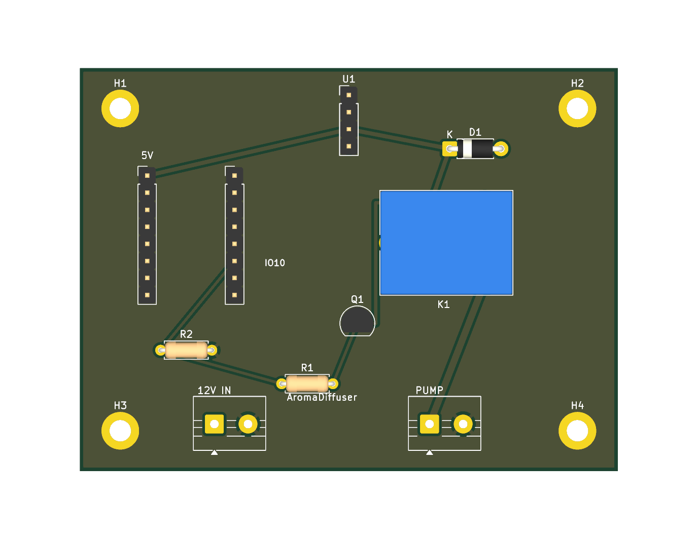

# ESP32_Relay — AromaDiffuser carrier board

A basic 2-layer carrier PCB for the [AromaDiffuser](../IMPLEMENTATION.md) controller:
**12 V in → buck → ESP32-C3 Super Mini → transistor → relay → pump out.**



~80 × 60 mm, 2-layer, **fully routed** with a GND pour. The relay is a dry SPDT
contact, so the switched side works for an **AC or DC** pump (subject to the mains
caveat below).

## How it was generated

Three scripts, run in order with KiCad's bundled Python. KiCad has no schematic
Python API, so each `.kicad_*` is written directly; the schematic and PCB are kept
consistent by sharing the same net names.

```bash
KPY=/Applications/KiCad/KiCad.app/Contents/Frameworks/Python.framework/Versions/Current/bin/python3
$KPY gen_board.py    # footprints, nets, GND pour, outline, mounting holes
$KPY gen_sch.py      # matching schematic (symbols + net labels)
$KPY gen_routes.py   # route the 6 non-GND nets
```

Verified with `kicad-cli`: schematic **ERC clean**, PCB **DRC clean (0 violations,
0 unrouted)**, and the schematic netlist matches the PCB. See `schematic.pdf`.

> The PCB carries its own netlist (no sheet-to-board link). If you edit the
> schematic and want to push changes, re-run `gen_routes.py` rather than KiCad's
> "Update PCB from schematic".

## ⚠️ Before you fabricate — verify these

It's DRC/ERC-clean, but still **bench-verify** the part-specific assumptions:

1. **C3 header pitch.** `A1`/`A2` are 2× 1×8 headers, rows **13 mm** apart. "Super
   Mini" clones vary — measure yours and adjust the `A1`/`A2` X positions in
   `gen_board.py` if needed before fab.
2. **Relay pinout.** Wired to the KiCad **SANYOU SRD** map (derived from the symbol):
   pin 1 = COM, pin 3 = NO, pins 2 & 5 = coil, pin 4 = NC (unused). Confirm your
   relay matches (SRD-05VDC-SL-C does).
3. **Transistor pinout.** Laid out for **PN2222A** in TO-92, pads 1-2-3 = **E-B-C**.
   A BC547 is C-B-E — different. Match the part to the footprint or you'll cook it.
4. **Mains pump = STOP.** This board's spacing (2.54 mm / 5 mm) is for a **low-voltage
   DC pump only**. If your pump is **AC mains**, do *not* run mains on this board —
   keep the mains switching on a separately mains-rated relay module off-board, or
   redesign for proper creepage/clearance + fusing + enclosure. (We still haven't
   measured the pump — do that first; see IMPLEMENTATION.md.)
5. **Buck.** `U1` is an **MP1584 module** on a 1×4 header — set its trimmer to **5.0 V
   before** connecting the C3.

## Netlist (matches `schematic.pdf` and the PCB)

| Net | Connections |
|-----|-------------|
| **+12V** | J1.1 (12V IN), U1.1 (buck VIN+), K1.1 (relay COM) |
| **+5V** | U1.3 (buck VOUT+), A1.1 (C3 5V), K1.2 (coil+), D1.1 (diode K) |
| **GND** | J1.2, U1.2, U1.4, A1.2 (C3 GND), Q1.1 (emitter), R2.2, J2.2, H1–H4, pour |
| **CTRL_IO10** | A2.6 (C3 GPIO10), R1.1, R2.1 |
| **Q_BASE** | R1.2, Q1.2 (base) |
| **COIL_DRV** | Q1.3 (collector), K1.5 (coil−), D1.2 (diode A) |
| **PUMP** | K1.3 (relay NO), J2.1 |

`R2` (10 k, GPIO10→GND) holds the transistor off during boot/reset → **pump off at
power-up**. `D1` is the coil flyback (band/cathode to +5 V).

## BOM

| Ref | Part | Notes |
|-----|------|-------|
| A1, A2 | 2× 1×8 socket header, 2.54 mm | seat the ESP32-C3 Super Mini |
| U1 | MP1584 buck module + 1×4 header | 12 V → **5.0 V** |
| K1 | SPDT relay, 5 V coil | SRD-05VDC-SL-C (or pin-compatible) |
| Q1 | NPN BJT, TO-92 | PN2222A (E-B-C) |
| D1 | diode, DO-41 | 1N4007 |
| R1 | resistor | 1 kΩ (base) |
| R2 | resistor | 10 kΩ (pulldown) |
| J1, J2 | 2-pin screw terminal, 5 mm | J1 = 12V IN, J2 = PUMP |
| H1–H4 | M3 mounting holes | grounded |

## Fab

Export gerbers:

```bash
/Applications/KiCad/KiCad.app/Contents/MacOS/kicad-cli pcb export gerbers --output gerbers/ ESP32_Relay.kicad_pcb
/Applications/KiCad/KiCad.app/Contents/MacOS/kicad-cli pcb export drill   --output gerbers/ ESP32_Relay.kicad_pcb
```

…or just upload `ESP32_Relay.kicad_pcb` directly to JLCPCB/PCBWay.
